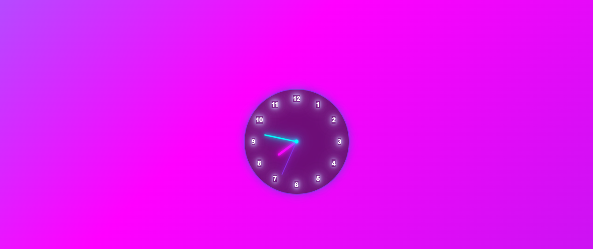

# 🕒 Neon Clock UI

A modern, fully responsive **Neon Clock** built with **HTML**, **SCSS**, and **JavaScript** — featuring smooth animations, neon glow effects, and an animated gradient background.  
No images or sound files are used — everything is generated with pure code.

---

## 🚀 Features

- ⚡ Real-time analog clock animation  
- 🌈 Animated neon gradient background  
- 💫 Soft glowing hover effects  
- 🧩 Scroll-based observer section animations  
- 📱 Fully responsive design (1200px → 300px)  
- 💎 Pure HTML, SCSS & JS — no images, no libraries  

---

## 🛠️ Tech Stack

| Technology | Purpose |
|-------------|----------|
| **HTML5** | Page structure |
| **SCSS (Sass)** | Styling and neon UI design |
| **JavaScript (ES6)** | Clock logic & intersection observer |
| **VS Code Live Server** | Local preview |

---

## 📸 Preview

> 🔮 A futuristic neon-style clock UI with smooth animations and glowing effects.




💻 Setup Instructions
```1️⃣ Clone the repository
git clone https://github.com/<your-username>/neon-clock.git
cd neon-clock
```

```2️⃣ Install Sass (if not already)
npm install -g sass
```

```3️⃣ Compile SCSS to CSS
sass --watch scss/main.scss dist/style.css
```

```4️⃣ Run the project
Use Go Live in VS Code or open index.html manually in your browser.
```
🧠 Future Improvements

Add digital clock overlay

Add theme switch (Dark / Cyberpunk / Glassmorphism)

Add customizable neon colors

🤝 Contributing

Contributions, feedback, and suggestions are always welcome!
Please check the CONTRIBUTING.md
 file for details.
